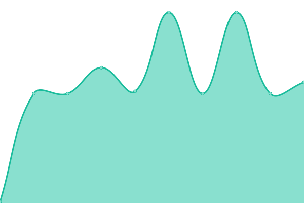

# [📈 Live Status](https://status.luucy.ch): <!--live status--> **🟧 Partial outage**

This repository contains the open-source uptime monitor and status page for [LUUCY](luucy.ch), powered by [Upptime](https://github.com/upptime/upptime).

With [Upptime](https://upptime.js.org), you can get your own unlimited and free uptime monitor and status page, powered entirely by a GitHub repository. We use [Issues](https://github.com/luucyadmin/luucy-status/issues) as incident reports, [Actions](https://github.com/luucyadmin/luucy-status/actions) as uptime monitors, and [Pages](https://status.luucy.ch) for the status page.

<!--start: status pages-->
<!-- This summary is generated by Upptime (https://github.com/upptime/upptime) -->
<!-- Do not edit this manually, your changes will be overwritten -->
<!-- prettier-ignore -->
| URL | Status | History | Response Time | Uptime |
| --- | ------ | ------- | ------------- | ------ |
|  [LUUCY](https://app.luucy.ch/login) | 🟩 Up | [luucy.yml](https://github.com/luucyadmin/luucy-status/commits/HEAD/history/luucy.yml) | 

 764ms
     
 | 

<a href="https://status.luucy.ch/history/luucy">100.00%</a>
    

|  [LUUCY API](https://app.luucy.ch/api/version) | 🟩 Up | [luucy-api.yml](https://github.com/luucyadmin/luucy-status/commits/HEAD/history/luucy-api.yml) | 

 130ms
     
 | 

<a href="https://status.luucy.ch/history/luucy-api">100.00%</a>
    

|  [LUUCY Data](https://cdndata-01.luucy.ch/terrain/sa/layer.json) | 🟩 Up | [luucy-data.yml](https://github.com/luucyadmin/luucy-status/commits/HEAD/history/luucy-data.yml) | 

 621ms
     
 | 

<a href="https://status.luucy.ch/history/luucy-data">100.00%</a>
    

|  [WMS: SwissImage](https://wms.geo.admin.ch/?SERVICE=WMS&REQUEST=GetMap&VERSION=1.3.0&LAYERS=ch.swisstopo.swissimage&STYLES=default&CRS=EPSG:2056&BBOX=2550000,1060000,2660000,1140000&WIDTH=800&HEIGHT=582&FORMAT=image/png) | 🟩 Up | [wms-swiss-image.yml](https://github.com/luucyadmin/luucy-status/commits/HEAD/history/wms-swiss-image.yml) | 

 500ms
     
 | 

<a href="https://status.luucy.ch/history/wms-swiss-image">100.00%</a>
    

|  [WMS: ÖREB](https://wmscache1001.luucy.ch/?service=WMS&version=1.1.1&request=GetMap&styles=&format=image%2Fjpeg&layers=ch_basemap_tlm_av_3&bbox=8.997459411621106%2C46.92157745361328%2C8.997802734374998%2C46.92192077636719&width=256&height=256&srs=EPSG%3A4326) | 🟥 Down | [wms-oe-reb.yml](https://github.com/luucyadmin/luucy-status/commits/HEAD/history/wms-oe-reb.yml) | 

 4516ms
     
 | 

<a href="https://status.luucy.ch/history/wms-oe-reb">97.68%</a>
    

<!--end: status pages-->

[**Visit our status website →**](https://status.luucy.ch)

## 📄 License

- Powered by: [Upptime](https://github.com/upptime/upptime)
- Code: [MIT](./LICENSE) © [LUUCY](luucy.ch)
- Data in the `./history` directory: [Open Database License](https://opendatacommons.org/licenses/odbl/1-0/)
